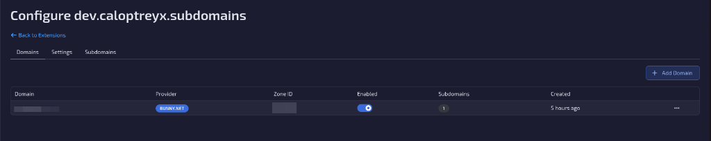
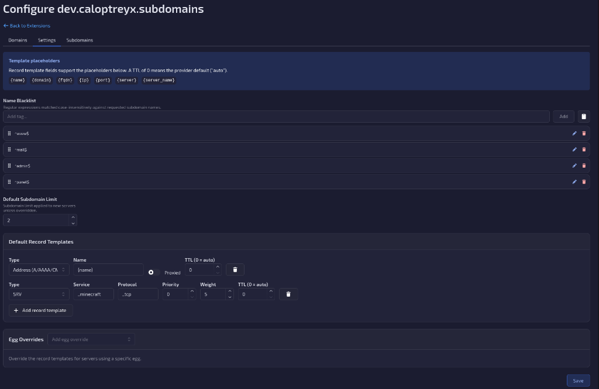
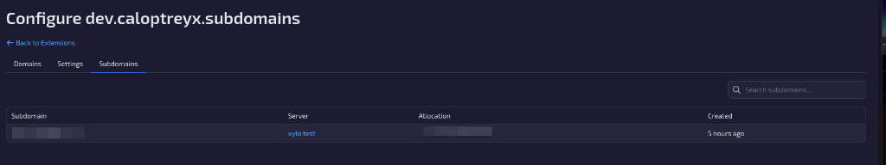

# Subdomain Manager

A [Calagopus Panel](https://calagopus.com) extension that lets users create and manage
subdomains for their game servers (mainly Minecraft) through **Cloudflare**, **Bunny.net DNS** or
**PowerDNS**.

Package name: `dev.caloptreyx.subdomains` · Requires panel `>=1.2.2`

## Features

- Users pick a domain, a name and one of their server's allocations; the extension creates the
  DNS records and shows the resulting `name.domain`.
- Seamless Minecraft integration: default record set is an address record plus a
  `_minecraft._tcp` SRV record, so players connect without typing a port.
- **Per-egg record templates** with placeholders (`{name}`, `{domain}`, `{fqdn}`, `{ip}`, `{port}`,
  `{server}`, `{server_name}`) – e.g. an A-only set for Minecraft Bedrock, or extra custom
  A/AAAA/CNAME/TXT records.
- **IP alias parsing**: the allocation's alias is used as the record target; hostnames become CNAME,
  IPv4 becomes A, IPv6 becomes AAAA.
- **Blacklist** subdomain names with regular expressions.
- **Per-server subdomain limit** exposed as `feature_limits.subdomains` and editable in the admin
  server create/update forms.
- **Proper cleanup**: DNS records are removed when a subdomain, its server or its allocation is
  deleted, and when a server is transferred to another node.
- **Allocation changes at any time**; after a server transfer the allocation is set to `null`
  (Unknown) so the user can re-point the subdomain, which creates new records.
- Admin overview of every subdomain across the panel, with search.

## Installation

Download `dev_caloptreyx_subdomains.c7s.zip` from the
[latest release](https://github.com/Caloptreyx/Subdomain-Manager/releases/latest) and either upload it under **Admin → Extensions**
or drop it into your heavy image's `build/extensions/` directory and `docker compose restart web`.
Extensions require the `:heavy` panel image (or a dev environment) — see the
[Calagopus docs](https://calagopus.com/docs/panel/extensions/installing-extensions).

## Configuration

**Admin → Extensions → Subdomain Manager → Configure**

- **Domains** – add the domains users may choose from.
  - *Cloudflare*: Zone ID (zone overview page) + an API token with `Zone:DNS:Edit` on that zone.
  - *Bunny.net*: numeric DNS zone id (from the dashboard URL) + an account API key.
  - *PowerDNS* (Authoritative, HTTP API enabled): zone name (e.g. `example.com`) + the webserver
    URL (e.g. `http://10.0.0.2:8081`, must be reachable from the panel container) + the `api-key`.
    The URL and key are stored together, so changing either requires entering both.
  Credentials are verified against the provider before saving and stored encrypted.
- **Settings** – blacklist regexes, default subdomain limit for new servers, default record
  templates and per-egg overrides. A TTL of `0` means "provider automatic" (300s on PowerDNS, which
  has no automatic TTL).
- **Subdomains** – searchable list of all subdomains with their servers. Admins can create
  subdomains on any server (not bound by the server limit or the name blacklist), move a subdomain
  to another allocation of its server, and delete it (with a forced delete if the DNS provider
  fails).

Permissions: server `subdomains.read|create|update|delete`, admin `subdomains.read|manage`.

## Screenshots

**Domains** – the DNS zones users can create subdomains on, with provider, status and usage.

**Settings** – name blacklist, default subdomain limit, default record templates and per-egg
overrides.

**Subdomains** – every subdomain across the panel with its server and allocation, and admin
create / change allocation / delete actions.

## API

- `GET|POST /api/client/servers/{server}/subdomains`, `PATCH|DELETE .../subdomains/{uuid}`
- `GET|PUT /api/admin/extensions/dev.caloptreyx.subdomains/settings`
- `GET|POST .../domains`, `PATCH|DELETE .../domains/{uuid}`, `POST .../domains/{uuid}/verify`
- `GET|POST .../subdomains` (list with `page&per_page&search`, admin create),
  `PATCH|DELETE .../subdomains/{uuid}`

Full schemas are in the panel's OpenAPI document once installed.

## Roadmap

- CLI command to migrate data from the Pterodactyl subdomain manager extension.

## License

MIT
